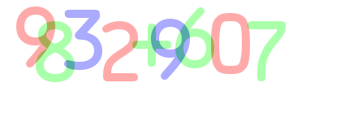

# Captcha
## 2017 삼성전자 해킹방어대회ASIM문제 환경 구축

* 문제의 동작을 확인하기
    * START 버튼을 누르면 80초 타이머가 작동합니다.
    * Captcah와 같은 형태로 수식이 등장하며, 이를 반복적으로 풀어야합니다.
    * 80초 안에 100개의 수식에 대하여 연속적으로 정답 처리를 받아야합니다.
    
* 문제 해결방법 생각하기
    * 특정한 수식 사진을 OpenCV로 처리하여, 각 문자를 하나씩 분리합니다.
    * 분리된 각 문자가 어떤 문자에 해당하는지 인식합니다.
    * 인식된 수식을 계산하여 정답을 도출합니다.
    

> 주어지는 수식 사진

* 문제 해결의 난점
  * 문제를 거듭하여 풀수록 수식의 길이가 길어집니다.
  * 이미지에서 각 문자는 색상으로 구분되어 있어 이를 정확히 분리해야합니다.
